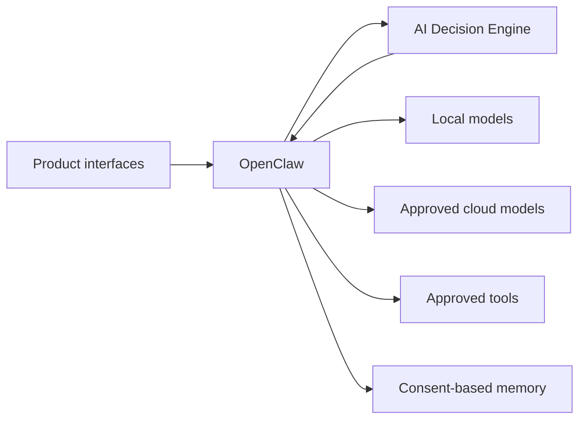

# Binita AI Lab project context

This sanitized document is the durable public source of truth for Binita AI Lab. It is written for hiring managers, contributors, future users, and coding agents. Update it when the Lab's verified mission, architecture, principles, or roadmap changes.

## Mission

Binita AI Lab builds practical, trustworthy AI products that combine product judgment with strong technical architecture. The Lab explores how AI systems can choose appropriate intelligence, protect privacy, control spending, use tools safely, and create measurable value in everyday workflows.

## AI Lab goals

- Build a coherent personal AI platform through focused product prototypes.
- Validate product assumptions with working evidence rather than feature lists.
- Demonstrate AI Product Management through prioritization, architecture, evaluation, security, and clear communication.
- Create a GitHub portfolio in which every repository tells a distinct, credible product story.
- Favor systems that are modular, explainable, replaceable, and operationally responsible.

## High-level architecture

- Product interfaces such as Telegram own channel-specific interaction, not model policy.
- OpenClaw owns conversations, authentication, orchestration, memory access, provider credentials, and model execution.
- AI Decision Engine is the single authority for model selection, privacy constraints, readiness, cost controls, and explanations.
- Models, memory, and tools remain replaceable behind explicit contracts.

## Hardware model

- **MacBook:** development, Codex collaboration, automated tests, documentation, Git, architecture, and review.
- **GPU workstation:** finished self-hosted runtime for containerized services and local inference.

Public documentation intentionally omits machine-specific configuration. Local operational details belong only in the ignored private context file.

## Product roles

### OpenClaw

OpenClaw is the intended platform control plane for conversations, sessions, provider authentication, quota state, tool orchestration, memory access, and model execution. It calls the AI Decision Engine for selection rather than duplicating routing policy.

### Telegram AI Assistant

Telegram AI Assistant is the next active product workstream and the planned mobile interface to the wider AI Lab. It is one exploration within the Lab, not the Lab's overall purpose. Telegram should authenticate users, carry messages, and render responses. It must not contain model-routing policy, provider credentials, or duplicated orchestration logic.

### AI Decision Engine

AI Decision Engine is a completed standalone model-routing product. It analyzes task requirements, applies privacy and capability constraints, verifies readiness and quota, selects the cheapest adequate approved model, controls metered API spend, and explains its decisions.

### Forge

Forge is a completed prototype exploring disciplined AI-assisted product building. Its value is the product workflow and decision-making discipline it demonstrates; it remains separate from unrelated product code.

## Product philosophy

- Start with a meaningful user problem and a falsifiable product question.
- Test the riskiest assumption before broadening the feature surface.
- Treat privacy, cost, reliability, and explainability as product requirements.
- Separate selection from execution, interfaces from business logic, and product code from shared infrastructure.
- Do not advertise capabilities that are not implemented and tested end to end.
- Prefer a clear limitation over simulated support or fabricated evidence.

## Development philosophy

- Prefer cohesive, production-quality implementations over temporary scripts.
- Use typed contracts and replaceable adapters at external boundaries.
- Avoid duplicated logic, hidden coupling, arbitrary shell execution, and hardcoded vendor routing.
- Test behavior, failure modes, security boundaries, and integration contracts.
- Keep changes focused and document non-obvious decisions.
- Explain technical choices clearly for product-minded readers without sacrificing accuracy.

## Repository philosophy

`ai-lab` is the documentation-only master repository. It owns the vision, ecosystem architecture, master roadmap, cross-product decisions, portfolio standards, and links to product repositories. It contains no production code, runtime services, deployment assets, or product-specific implementation.

Each substantial product has a separate repository with its own code, tests, architecture, decisions, evidence, changelog, deployment documentation, and roadmap. Repositories integrate through versioned contracts rather than copied internals.

## Current roadmap

- **Completed:** AI Decision Engine v0.1.0 and the Forge prototype.
- **In progress:** AI Lab portfolio documentation and Telegram AI Assistant discovery and architecture.
- **Blocked:** No workstream is formally blocked. Telegram implementation awaits deliberate decisions about channel integration, router transport, tool ownership, memory policy, and ingress.
- **Next:** Create the clean Telegram Assistant repository, finalize contracts, and validate a secure local-model chat path before expanding capabilities.

The active roadmap describes delivery sequence. The broader focus of the Lab is to explore where AI can improve different facets of life, increase everyday efficiency, and turn ideas into useful outcomes.

The detailed status tracker is maintained in [`docs/roadmap.md`](docs/roadmap.md).

## Architecture and security principles

- Interfaces do not choose models.
- OpenClaw owns orchestration and execution.
- AI Decision Engine owns model selection.
- Models never receive unrestricted infrastructure authority.
- Tools are explicit, typed, allowlisted, authorized, auditable, and narrowly scoped.
- Memory is consent-based, user-scoped, attributable, correctable, and deletable.
- Cloud processing requires explicit permission and justified value.
- Secrets and private operational details remain outside public repositories.
- Public claims distinguish planned, implemented, tested, and live-validated states.

## Documentation standards

- Assume every public file may be read by a hiring manager.
- State current status, scope, evidence, and limitations precisely.
- Keep architecture, behavior, configuration, and roadmap documentation synchronized.
- Record durable ecosystem decisions under `docs/decisions/`; product-specific decisions stay with the product.
- Prefer concise, direct writing and diagrams that clarify real ownership or data flow.
- Never publish local paths, network details, machine identifiers, credentials, personal information, or confidential information.
