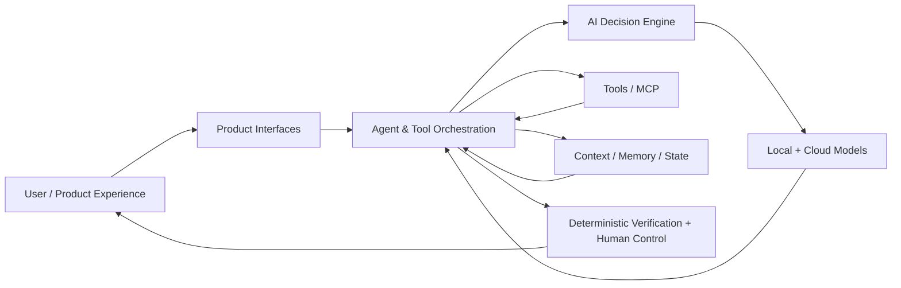

# Binita AI Lab

### **AI Product Leader | Building AI-native systems hands-on**

I have spent more than a decade building and leading products, including AI and ML systems at Google and Yelp that operate at significant scale. This Lab is where I go deeper hands-on: designing, building, instrumenting, and evaluating AI-native systems myself so that my product judgment is grounded in how the technology actually behaves.

I am particularly interested in what changes when AI moves beyond conversation and becomes part of the operating system of a product: when models can reason over context, use tools, maintain state, retrieve knowledge, take actions, and collaborate with people inside explicit boundaries.

**I don't just use AI to accelerate existing workflows. I redesign products and workflows around what becomes possible when AI can reason over context, use tools, maintain state, and collaborate with humans.**

This repository is the public product and architecture layer for that work.

## What I am exploring

The Lab is intentionally broader than a single application or model. I use working products and focused experiments to investigate the product questions behind modern AI systems:

- **Agents & orchestration** — when an agent should reason, delegate, invoke a workflow, or stop and ask for human judgment
- **Context engineering** — what information a system needs, when it needs it, and how to keep context useful rather than merely large
- **Tools & MCP** — how models should discover and use external capabilities, and where deterministic software should take over
- **Memory & state** — what should persist across interactions, what should not, and how users retain control
- **Retrieval & RAG** — when retrieval improves an experience, how provenance should work, and when simpler context is enough
- **Model routing & economics** — how to choose among local and cloud models based on capability, privacy, readiness, latency, and cost
- **Evaluation & observability** — how to measure behavior, identify failure modes, and distinguish a convincing demo from a dependable product
- **Human oversight & AI safety** — where approval, verification, guardrails, and explicit authority boundaries belong
- **AI-native workflows** — how work itself changes when AI can move from understanding intent to using tools and producing verifiable outcomes

The point is not to collect technologies. It is to understand the product decisions each capability creates.

## Flagship systems

These are the most complete systems in the Lab today. They examine different layers of the same question: **what does it take for AI to do useful work reliably, not merely generate a response?**

| System | Product question | AI product depth |
|---|---|---|
| [AI Decision Engine](https://github.com/binitamukeshshah/ai-decision-engine) | **How should an AI system choose which intelligence to use?** | Model routing across capability, privacy, readiness, quota, cost, and local/cloud execution |
| [Telegram Assistant](https://github.com/binitamukeshshah/telegram-assistant) | **How should an AI system reliably interact with a person and take action?** | Agentic interaction, tools, deterministic state changes, durable capture, local-first execution, and honest failure handling |
| [Project OS](https://github.com/binitamukeshshah/project-os) | **How should an AI system maintain context and control across ongoing work?** | Persistent state, provenance, project context, approval boundaries, capability control, and human oversight |

Together, they explore a progression from **choosing intelligence → acting reliably → maintaining context over time**.

## Experiments & supporting systems

Not every useful question needs to become a flagship product. Smaller systems let me isolate a capability, test an assumption, or build infrastructure that supports the wider Lab.

| Project | Question / purpose | Status |
|---|---|---|
| [Forge](https://github.com/binitamukeshshah/forge) | Can an AI development companion reduce the friction between product intent and a structured, working artifact? | Prototype complete; intentionally paused |
| **AI Lab CLI** | What lightweight operator experience is useful across the Lab? | Early exploration |
| **Evaluation harnesses** | How should I compare model, routing, agent, and workflow behavior systematically rather than relying on anecdotal success? | Expanding across projects |
| **Future experiments** | Focused builds around retrieval, memory, tool use, agent coordination, observability, and AI-native workflows | Added as hypotheses warrant |

The portfolio will grow, but breadth is not the goal. A new project earns a place here when it helps answer a meaningful AI product question.

## From product question to evidence

I build because implementation exposes product questions that architecture diagrams and strategy documents can hide.

My working loop is:

**Product question → hypothesis → architecture → working system → evaluation → failure analysis → product decision → iteration**

For each system, I want the evidence to answer more than *does it run?*:

- Does it complete the intended task reliably?
- Where does it fail, and are those failures detectable?
- Which decisions belong to the model versus deterministic software?
- What happens when tools, providers, or dependencies are unavailable?
- What quality threshold is good enough for the use case?
- What are the latency, privacy, and cost tradeoffs?
- When should a human review, approve, or override the system?
- What did the evidence cause me to change?

That last question matters most. **Evaluation is useful when it changes a product decision.**

## How the system fits together

The architecture is deliberately modular. Product interfaces should not own model policy. Models should not be treated as proof that an action occurred. Tools and memory need explicit authority boundaries. Model providers should remain replaceable where practical.

The [AI Lab architecture](docs/architecture.md) documents request flow, system boundaries, and deployment principles in more detail.

## How I build

I use AI extensively in implementation, but I do not treat generated code or model output as evidence that a product decision is correct. I own the product question, architecture, scope, acceptance criteria, tradeoffs, and evaluation.

My current environment spans:

| Layer | Current tools / approach |
|---|---|
| **Development** | Python, Docker, Git, AI-assisted development |
| **Agent orchestration** | OpenClaw, reusable workflows, tool-enabled agents |
| **Local inference** | Ollama with Qwen, Gemma, and DeepSeek model families |
| **Cloud intelligence** | Used selectively when capability justifies the privacy, cost, or latency tradeoff |
| **Compute** | MacBook for development + dedicated GPU workstation for local inference and deployed services |

The technology will change. The product questions are more durable.

## What this repository documents

AI Lab is the public source of truth connecting the products, experiments, and decisions across the portfolio:

- [Vision](docs/vision.md) — the longer-term product thesis
- [Roadmap](docs/roadmap.md) — active build sequence and status
- [Architecture](docs/architecture.md) — ecosystem boundaries and request flow
- [Project index](docs/projects/README.md) — verified projects and repositories
- [Decision index](docs/decisions/README.md) — durable cross-product decisions
- [Repository standards](docs/repository-standards.md) — expectations for product repositories
- [Project context](PROJECT_CONTEXT.md) — sanitized context that keeps future work consistent

The documentation is intentionally designed to preserve rejected approaches, constraints, failures, and changes in direction alongside successful code. Those are part of the product evidence too.

## Where this is going

The long-term goal is to build a body of evidence about how AI-native products should be designed when they need to **understand context, use tools, make decisions, maintain state, take action, and remain accountable to people**.

Some experiments will become products. Some will remain focused tests. Some will be discarded because the evidence does not support the hypothesis.

That is the point of the Lab: **build enough to know, evaluate enough to decide, and document enough to make the reasoning visible.**
