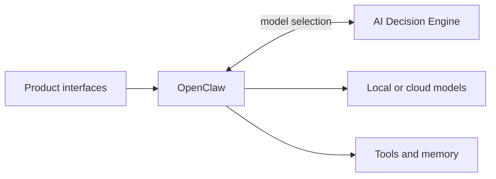

# Binita AI Lab

**A product-led laboratory for building useful, trustworthy AI systems from first principles.**

Binita AI Lab is where I turn AI product questions into working prototypes, measurable decisions, and clear product narratives. It is both my architectural source of truth and the homepage for a portfolio of focused AI products.

I am building the Lab to explore a practical question: **how should an AI product decide what intelligence, context, and tools to use for each job—without sacrificing privacy, cost control, or user trust?**

## The long-term vision

The Lab will become a personal AI platform that can move naturally between local and cloud intelligence, remember what matters with consent, use approved tools safely, and meet users in the interfaces they already use. Each prototype validates one part of that vision before it becomes shared platform capability.

## Architecture

- **Interfaces** make the platform accessible; they contain no model-routing policy.
- **OpenClaw** owns conversations, authentication, orchestration, tools, memory access, and model execution.
- **AI Decision Engine** owns model selection, privacy constraints, readiness checks, cost controls, and explanations.
- **Models and tools** remain replaceable behind explicit contracts.

See the complete [ecosystem architecture](docs/architecture.md).

## Hardware and stack

| Environment | Responsibility |
|---|---|
| **MacBook** | Product development, Codex collaboration, tests, Git, documentation, and GitHub publishing |
| **GPU workstation** | Finished self-hosted runtime for containerized services, OpenClaw, local models, and deployed products |

The current stack includes Python, Docker, OpenClaw, Ollama, Qwen, Gemma, and DeepSeek. Cloud routes may be added deliberately through OpenClaw when a validated use case justifies them.

## Product portfolio

| Repository | Product question | Status |
|---|---|---|
| `ai-decision-engine` | Can the platform select the cheapest adequate model while respecting privacy, readiness, quota, and cost? | **Completed v0.1.0** |
| `forge` | How can an AI product turn intent into a disciplined build process and stronger product artifacts? | **Completed prototype** |
| `telegram-assistant` | Can Telegram become a secure mobile interface to the wider AI Lab? | **Current priority** |
| `ai-lab-cli` | What lightweight operator experience is useful across the Lab? | **Early exploration** |
| Future products | Google Workspace Assistant, Family AI, Content Studio, and AI Interview Coach | **Next** |

Product source code belongs in its own repository. This repository contains only shared context, architecture, roadmap, decisions, standards, and navigation. See the [project index](docs/projects/README.md).

## Roadmap

1. Establish the AI Lab documentation and repository system.
2. Preserve the completed AI Decision Engine as the routing boundary.
3. Build Telegram AI Assistant through OpenClaw without duplicating routing logic.
4. Add safe tools and consent-based memory only after their contracts are explicit.
5. Apply the platform to Google Workspace, family coordination, content, and interview coaching.

Track current status in the [master roadmap](docs/roadmap.md).

## Learning philosophy

The Lab favors learning through shipped evidence. Each project starts with a product hypothesis, isolates the riskiest assumption, creates the smallest credible system that tests it, and documents what the result does—and does not—prove. Technical depth supports product judgment rather than replacing it.

## Navigate the Lab

- [Vision](docs/vision.md)
- [Master roadmap](docs/roadmap.md)
- [Architecture](docs/architecture.md)
- [Project index](docs/projects/README.md)
- [Decision index](docs/decisions/README.md)
- [GitHub portfolio strategy](docs/github-portfolio.md)
- [Repository standards](docs/repository-standards.md)
- [Permanent project context](PROJECT_CONTEXT.md)
