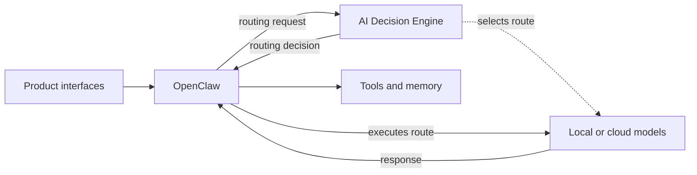

# Binita AI Lab

### **AI Product Leader | Building and evaluating AI-native systems hands-on**

I design, build, and evaluate working AI products to understand what it takes to make them useful, reliable, and ready to scale.

This lab is where I test product hypotheses through working systems: how agents use context and tools, how models are selected and orchestrated, how AI maintains state and memory, how actions are verified, and where humans should remain in control.

Each project moves from **product question → working system → evaluation → failure analysis → product decision**.

The goal isn't to build demos. It's to develop evidence about what actually works.

## What Binita AI Lab is

Binita AI Lab is the product and architecture layer for a growing set of AI-native systems I build end to end. Each project starts with a concrete product question and turns it into a working system that can be tested against real constraints.

Across the Lab, I explore recurring AI product problems: model selection and orchestration, agent and tool behavior, context and state, privacy and cost, reliability, evaluation, and human control. The projects are intentionally connected so that capabilities and lessons from one system can inform the next.

The Lab documents more than what was built. It captures the **hypotheses, architecture, product decisions, tradeoffs, failure modes, evaluation evidence, and boundaries** behind each system.

The result is not a collection of AI demos. It is a working portfolio of AI product decisions made concrete through software.

## How the system fits together

- **Product interfaces** make the system accessible without owning model policy.
- **OpenClaw** manages conversations, authentication, orchestration, memory access, tools, and execution.
- **AI Decision Engine** selects the local or cloud route using privacy, capability, readiness, quota, and cost constraints; it does not execute the model.
- **Models, tools, and memory** remain replaceable behind explicit boundaries.

The full design—including request flow, repository ownership, and deployment principles—is documented in the [AI Lab architecture](docs/architecture.md).

## What I am building

The Lab currently centers on three systems that test different layers of the same product problem: **how to make AI useful when it must do more than generate a response.**

| System | Product question | What it demonstrates |
|---|---|---|
| [AI Decision Engine](https://github.com/binitamukeshshah/ai-decision-engine) | How should an AI system choose which intelligence to use? | Model selection and routing across privacy, capability, readiness, quota, and cost constraints |
| [Telegram Assistant](https://github.com/binitamukeshshah/telegram-assistant) | How should an AI system reliably interact with a person and take action? | Agentic interaction, tool use, deterministic state changes, local-first execution, and honest failure handling |
| [Project OS](https://github.com/binitamukeshshah/project-os) | How should an AI system maintain context and control across ongoing work? | Persistent state, provenance, project context, approval boundaries, and human control |

Together, they explore a progression from **choosing intelligence → acting reliably → maintaining context over time**.

[Forge](https://github.com/binitamukeshshah/forge) is a supporting prototype focused on developer experience: reducing the friction between product intent and a structured, working AI project. Its development is intentionally paused while I prioritize the three systems above.

Each system has an explicit product question, architecture, responsibility boundaries, tests, limitations, and roadmap. As the Lab matures, I am adding stronger evaluation evidence so product decisions can be grounded not only in whether a system works, but **how well it works, where it fails, what it costs, and when a different design is warranted**.

## How I work

My learning loop is intentionally product-led:

1. Start with a problem I experience or can observe clearly.
2. Frame the product question and identify the riskiest assumption.
3. Design the smallest credible system that can test it.
4. Build enough of the product to create real evidence.
5. Evaluate behavior, failures, privacy, cost, and user value.
6. Document what worked, what did not, and what should happen next.

I use AI to accelerate implementation, but I do not outsource product judgment to it. Architecture, scope, tradeoffs, acceptance criteria, and evidence still require deliberate choices. The purpose of building is not merely to produce code; it is to make those choices concrete enough to examine.

## Development environment

| Environment | Responsibility |
|---|---|
| **MacBook** | Product design, AI-assisted development, tests, documentation, Git, and review |
| **GPU workstation** | Finished self-hosted services, local inference, and deployed product workloads |

The platform currently uses Python, Docker, OpenClaw, Ollama, and local model families including Qwen, Gemma, and DeepSeek. Cloud models are introduced deliberately when a validated use case justifies the privacy, cost, or capability tradeoff.

## What this repository documents

This repository is the public architectural and product source of truth for the Lab. Readers can follow:

- the [vision](docs/vision.md) behind the Lab;
- the [master roadmap](docs/roadmap.md) and current status of each workstream;
- the [ecosystem architecture](docs/architecture.md) and responsibility boundaries;
- the [project index](docs/projects/README.md) linking independent prototypes;
- the [decision index](docs/decisions/README.md) for durable cross-product choices;
- the [GitHub portfolio strategy](docs/github-portfolio.md);
- the [standards](docs/repository-standards.md) applied to future product repositories; and
- the sanitized [project context](PROJECT_CONTEXT.md) used to keep future work consistent.

This is meant to remain useful when an experiment fails or a decision changes. Successful code is only one kind of evidence; rejected approaches, constraints, and lessons are part of the product story too.

## Where the Lab is going

The Lab is an ongoing exploration of how AI can improve different facets of life and make everyday work more efficient. I want to understand where AI creates genuine leverage—not only in software, but in how I plan, communicate, learn, create, make decisions, and turn ideas into useful outcomes.

Each new product will begin with a real need and a clear question about whether AI can make that experience meaningfully better. Some experiments may become standalone products; others may become reusable workflows, shared capabilities, consulting insights, or lessons that shape the next idea.

The [master roadmap](docs/roadmap.md) tracks the active build sequence without limiting the broader direction of the Lab.
