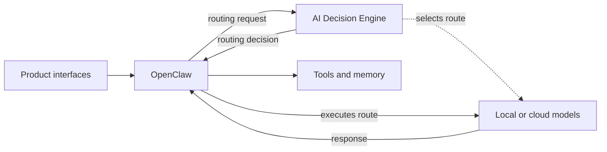

# Binita AI Lab

### **AI Product Leader | Building and evaluating AI-native systems hands-on**

I design, build, and evaluate working AI products to understand what it takes to make them useful, reliable, and ready to scale.

This lab is where I test product hypotheses through working systems: how agents use context and tools, how models are selected and orchestrated, how AI maintains state and memory, how actions are verified, and where humans should remain in control.

Each project moves from **product question → working system → evaluation → failure analysis → product decision**.

The goal isn't to build demos. It's to develop evidence about what actually works.

## What Binita AI Lab is

Binita AI Lab is a product-led environment for designing and testing useful AI systems. It is both:

- a growing ecosystem of focused AI product prototypes; and
- the engineering notebook behind them—the decisions, experiments, tradeoffs, failures, evidence, and lessons that shape the platform.

This is not a showcase of disconnected demos. Each project isolates a real product question, tests a risky assumption, and contributes one understood capability to a longer-term platform vision.

That vision is a personal AI ecosystem that can move deliberately between local and cloud intelligence, use approved tools safely, remember with consent, control cost, and meet users in interfaces they already understand.

## How the system fits together

- **Product interfaces** make the system accessible without owning model policy.
- **OpenClaw** manages conversations, authentication, orchestration, memory access, tools, and execution.
- **AI Decision Engine** selects the local or cloud route using privacy, capability, readiness, quota, and cost constraints; it does not execute the model.
- **Models, tools, and memory** remain replaceable behind explicit boundaries.

The full design—including request flow, repository ownership, and deployment principles—is documented in the [AI Lab architecture](docs/architecture.md).

## What I am building

| Product | The question it explores | Status |
|---|---|---|
| [AI Decision Engine](https://github.com/binitamukeshshah/ai-decision-engine) | Can an AI platform choose the cheapest adequate model while respecting privacy, readiness, quota, and cost? | **Completed v0.1.0** |
| Forge | Can AI create a more disciplined path from product intent to a working, reviewable artifact? | **Completed prototype** |
| Telegram AI Assistant | Can Telegram become a secure mobile interface to a modular personal AI platform? | **Current priority** |
| AI Lab CLI | What lightweight operator experience is useful across the Lab? | **Early exploration** |
| Future products | How can the platform create value in productivity, content, coordination, and career development? | **Next** |

Each product has—or will have—its own repository, architecture, tests, evaluation evidence, roadmap, and limitations. Product code does not live here. Verified links and status are maintained in the [project index](docs/projects/README.md).

## How I work

My learning loop is intentionally product-led:

1. Start with a problem I experience or can observe clearly.
2. Frame the product question and identify the riskiest assumption.
3. Design the smallest credible system that can test it.
4. Build enough of the product to create real evidence.
5. Evaluate behavior, failures, privacy, cost, and user value.
6. Document what worked, what did not, and what should happen next.

I use AI to accelerate implementation, but I do not outsource product judgment to it. Architecture, scope, tradeoffs, acceptance criteria, and evidence still require deliberate choices. The purpose of building is not merely to produce code; it is to make those choices concrete enough to examine.

## Development environment

| Environment | Responsibility |
|---|---|
| **MacBook** | Product design, AI-assisted development, tests, documentation, Git, and review |
| **GPU workstation** | Finished self-hosted services, local inference, and deployed product workloads |

The platform currently uses Python, Docker, OpenClaw, Ollama, and local model families including Qwen, Gemma, and DeepSeek. Cloud models are introduced deliberately when a validated use case justifies the privacy, cost, or capability tradeoff.

## What this repository documents

This repository is the public architectural and product source of truth for the Lab. Readers can follow:

- the [vision](docs/vision.md) behind the Lab;
- the [master roadmap](docs/roadmap.md) and current status of each workstream;
- the [ecosystem architecture](docs/architecture.md) and responsibility boundaries;
- the [project index](docs/projects/README.md) linking independent prototypes;
- the [decision index](docs/decisions/README.md) for durable cross-product choices;
- the [GitHub portfolio strategy](docs/github-portfolio.md);
- the [standards](docs/repository-standards.md) applied to future product repositories; and
- the sanitized [project context](PROJECT_CONTEXT.md) used to keep future work consistent.

This is meant to remain useful when an experiment fails or a decision changes. Successful code is only one kind of evidence; rejected approaches, constraints, and lessons are part of the product story too.

## Where the Lab is going

The Lab is an ongoing exploration of how AI can improve different facets of life and make everyday work more efficient. I want to understand where AI creates genuine leverage—not only in software, but in how I plan, communicate, learn, create, make decisions, and turn ideas into useful outcomes.

Each new product will begin with a real need and a clear question about whether AI can make that experience meaningfully better. Some experiments may become standalone products; others may become reusable workflows, shared capabilities, consulting insights, or lessons that shape the next idea.

The [master roadmap](docs/roadmap.md) tracks the active build sequence without limiting the broader direction of the Lab.
