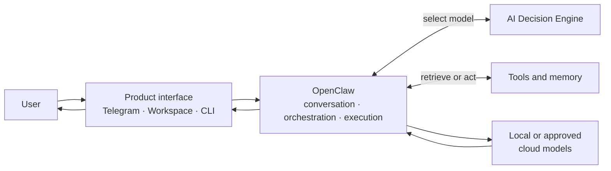
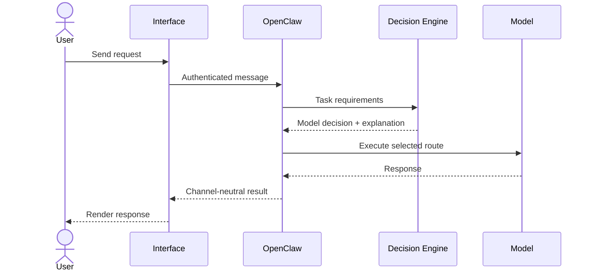

# AI Lab architecture

Binita AI Lab is a portfolio of independent AI products connected by clear platform boundaries. Interfaces stay thin, OpenClaw coordinates the experience, and the AI Decision Engine remains the single authority for model selection.

## System architecture

### Core boundaries

| Component | Responsibility |
|---|---|
| **Product interfaces** | Channel identity, interaction design, input normalization, and response rendering |
| **OpenClaw** | Conversations, authentication, context assembly, tool orchestration, memory access, provider credentials, and model execution |
| **AI Decision Engine** | Privacy constraints, capability fit, readiness, quota, cost, model ranking, fallback order, and explanation |
| **Tools** | Explicit, typed, authorized, auditable domain operations |
| **Memory** | Consent-based, user-scoped information with provenance, correction, retention, and deletion |
| **Models** | Replaceable generation resources invoked through OpenClaw |

The boundaries are deliberate:

- Interfaces never choose models.
- OpenClaw never duplicates routing policy.
- The router never owns conversations, tools, memory, or provider credentials.
- Models never receive unrestricted access to infrastructure.

## Request flow

OpenClaw may retrieve consented memory or invoke an approved tool during this flow. Those operations remain behind typed, authorized contracts; they do not change who owns model selection.

## Repository boundaries

| Repository | Owns |
|---|---|
| `ai-lab` | Vision, ecosystem architecture, master roadmap, standards, decisions, and portfolio navigation |
| `ai-decision-engine` | Model-routing product and its service contract |
| `telegram-assistant` | Telegram product experience and OpenClaw channel integration |
| `forge` | AI-assisted product-building prototype |
| `ai-lab-cli` | Operator and developer interface exploration |
| Future product repositories | Their own user experience, domain behavior, tests, evidence, and deployment |

These are peer repositories. `ai-lab` links them; it does not contain their source code. Products integrate through versioned contracts rather than copied internals.

## Development and deployment

- The **MacBook** is used for product work, implementation, tests, documentation, and review.
- The **GPU workstation** runs finished, reviewed services and local inference.
- Runtime services use authenticated boundaries, least privilege, external secret injection, health checks, and recoverable persistence.
- Machine-specific topology stays in ignored local context, never in public documentation.

## Architecture principles

1. One authoritative owner for every policy decision.
2. Local models when adequate; cloud models only when justified and permitted.
3. Product-specific code stays with the product that owns it.
4. Shared infrastructure emerges from proven reuse, not speculation.
5. Cross-repository contracts are versioned and tested on both sides.
6. Planned, implemented, tested, and live-validated capabilities are described separately.
